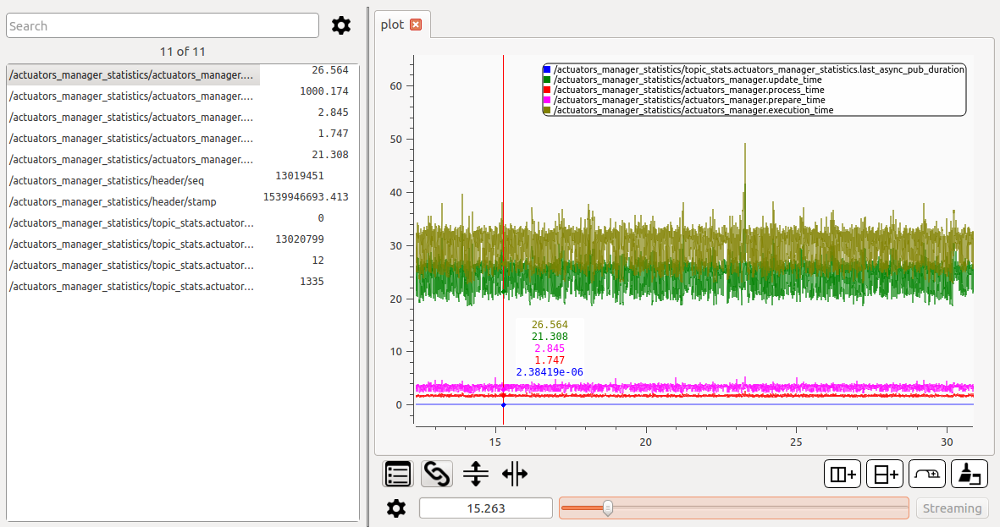
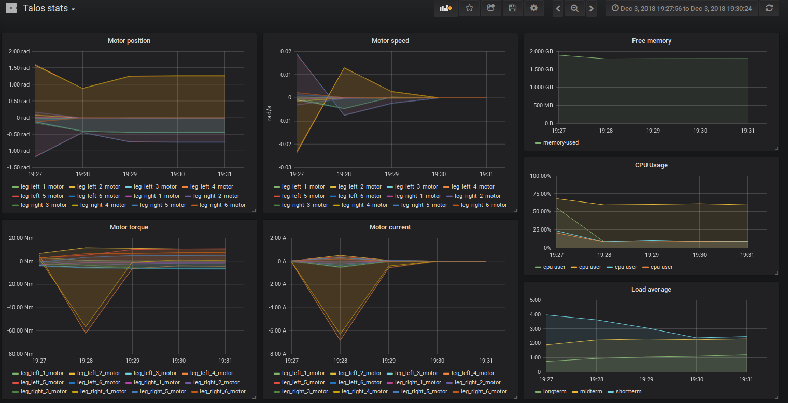

# PAL Statistics Framework

[](https://travis-ci.org/pal-robotics/pal_statistics)

The PAL Statistics Framework provides a way of gathering, aggregating, storing and visualizing statistics from arbitrary sources in a flexible and real-time safe way in ROS. From internal variables values to high level statistics about, but not limited to, robot performance.

## Data logging

To log a variable, it must be registered with a name to a topic.
Registering can be as easy as:
```
  double my_variable = 3.0;
  REGISTER_VARIABLE("/statistics_topic", "my_variable_name", &my_variable);
```
To publish all variables registered to a topic:
```
PUBLISH_STATISTICS("/statistics_topic");
```
  
And to unregister:
```
UNREGISTER_VARIABLE("/statistics_topic", "my_variable_name");
```


## Data transmission and storing

Data is sent via ROS topics of type [pal_statistics_msgs/Statistics](pal_statistics_msgs/msg/Statistics.msg) which basically is an array of names/doubles.

Data can be stored as rosbags, like all ros topics.
It's also designed to be integrated with [Graphite](https://graphiteapp.org/), which is:
>Graphite is an enterprise-ready monitoring tool that runs equally well on cheap hardware or Cloud infrastructure. Teams use Graphite to track the performance of their websites, applications, business services, and networked servers. It marked the start of a new generation of monitoring tools, making it easier than ever to store, retrieve, share, and visualize time-series data.

## Data visualization

Data can be visualized with any tools that display ROS topics, but we recommend [PlotJuggler](https://github.com/facontidavide/PlotJuggler) for viewing high resolution live data, or data in bags.


Or you can view historic data via [Grafana](https://grafana.com/)


## Tutorials

The tutorials are hosted on the [ROS wiki](http://wiki.ros.org/pal_statistics/Tutorials/Registering%20and%20publishing%20variables)

## Acknowledgements
***
<!-- 
    ROSIN acknowledgement from the ROSIN press kit
    @ https://github.com/rosin-project/press_kit
-->

<a href="http://rosin-project.eu">
  
</a>

Supported by ROSIN - ROS-Industrial Quality-Assured Robot Software Components.  
More information: <a href="http://rosin-project.eu">rosin-project.eu</a>

  

This project has received funding from the European Union’s Horizon 2020  
research and innovation programme under grant agreement no. 732287. 
